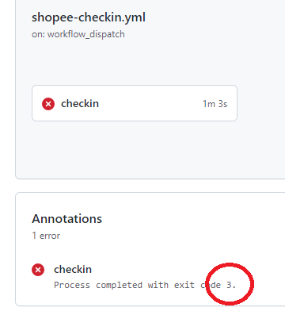

# 蝦皮簽到機器人疑難排解與錯誤回報

不妨先逛一逛 [issues](https://github.com/wdzeng/bot-automation/issues?q=)，說不定有人提出了你想問的問題。

## 第一次手動簽到失敗的應對

機器人失敗的最有可能的原因是因為設定了錯誤的帳號與密碼。請參考[設定帳號、密碼與加密金鑰](#設定帳號密碼與加密金鑰)章節，確定 `SHOPEE_USERNAME`、`SHOPEE_PASSWORD`、`AES_KEY` 沒有設錯或打錯字。

另外可參考 workflow 之錯誤訊息。下圖紅色圈起來的地方表示錯誤代碼。

> 

參考錯誤代碼一覽表：

| 錯誤代碼 | 說明 |
| ------- | ---- |
| 2       | 僅發生於機器人排程簽到時。機器人因故又遇到簡訊驗證，可能是因為你在上一次簽到成功後改過密碼。請再次手動跑一次機器人。 |
| 3       | 因為短時間內嘗試登入次數過多，觸發了蝦皮的拼圖遊戲。機器人沒辦法解決這個問題，只能一段時間後再試試看了。 |
| 4       | 操作逾時。可能是機器人的 bug，也有可能跟蝦皮的認證政策本身有關係。 |
| 5       | 觸發電子郵件驗證，目前機器人尚不支援。但有[取消信箱驗證的方法](https://github.com/wdzeng/bot-automation/issues/12#issuecomment-1163863582)。 |
| 6       | 你拒絕讓機器人登入。 |
| 69      | 因為短時間內嘗試登入次數過多被蝦皮 ban 了。只能一段時間後再試試看。 |
| 87      | 帳號或密碼錯誤。 |
| 88      | 不明錯誤。這一定是機器人本身的 bug，請聯繫開發者。 |

最棘手的錯誤代碼是 4 和 88，這可能表示機器人有 bug。為了應付這樣的情況，你可以查看螢幕截圖。螢幕截圖可以在下面的地方下載，解壓縮之後就有截圖了。

## 錯誤回報

如果你沒有任何頭緒，或覺得問題可能出在機器人本身，歡迎到 [issue](https://github.com/wdzeng/bot-automation/issues?q=) 區提出問題或回報錯誤。你的回報不僅可以協助開發者找出潛在的 bug，對其他使用者也會有很多幫助！

描述問題時，以下幾點值得提及，這有助於開發者釐清問題：

- 你的密碼少於 8 個字或超過 16 個字 (wdzeng/shopee-coins-bot#4)
- 你的帳號或密碼含有特殊符號（空格、括號、錢字號、引號等）
- 你的蝦皮帳號沒有綁定手機
- 你的蝦皮帳號很老或很新 (wdzeng/bot-automation#16)
- 你的蝦皮帳號是在國外註冊的

如果你的問題涉及個資或帳號密碼，不方便公開討論，可以私下[聯繫開發者](../README.md#聯繫開發者)。
